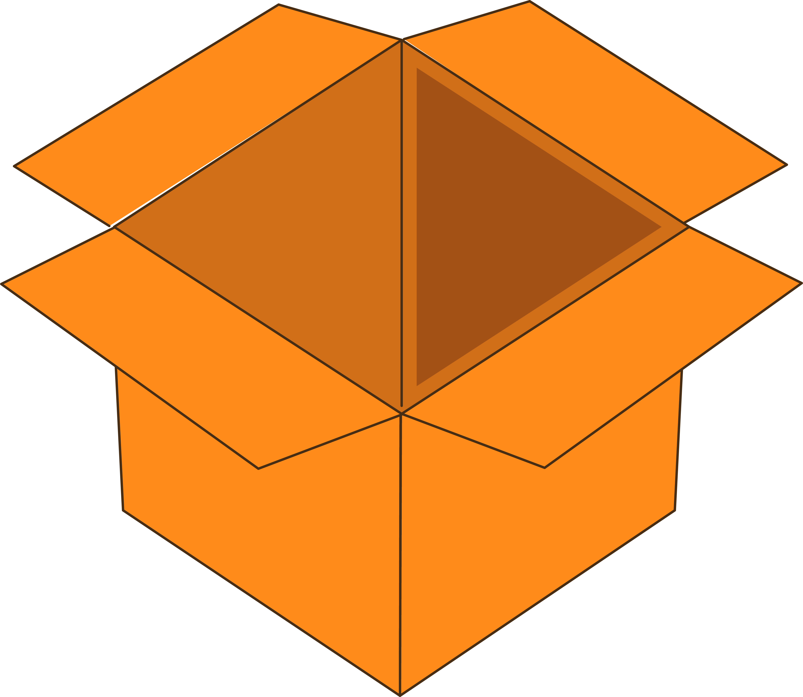
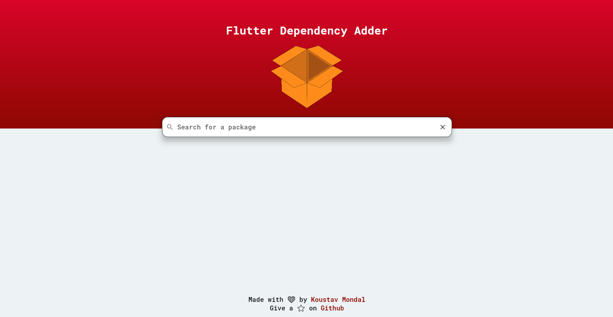

# 📦 Flutter Dependency Adder

<center>
    
</center>

<center> <h1> Hit ⭐ to show some ❤😃</h1> </center>

## 📃 Description

It is a platform to select your favorite dependencies and add them to your project with a single
command.

## 👨‍💻 Tech Stack


## 📸 Screenshots

<b>Home Screen</b>


<br>

<b>Search Screen</b>


## ⚙ How to run the application

1. Create `.env` and copy the variables from `.env.example` and fill them.
    ```shell
    cp .env.example .env
    ```

2. Get the flutter packages
    ```shell
    flutter pub get
    ```
3. Run the application
    ```shell
    flutter run -d <device-name>
    ```

> 💡 This flutter project is made to run in web. So it is preferred to run in a browser.

## 🙍‍♂️ Author

- 👦 [ThunderBlast](https://github.com/XxThunderBlastxX)

## 📃 Licence

Copyright © 2023 [ThunderBlast](https://github.com/xXThunderBlastxX).<br />
This project is [MIT](LICENCE) licensed.

